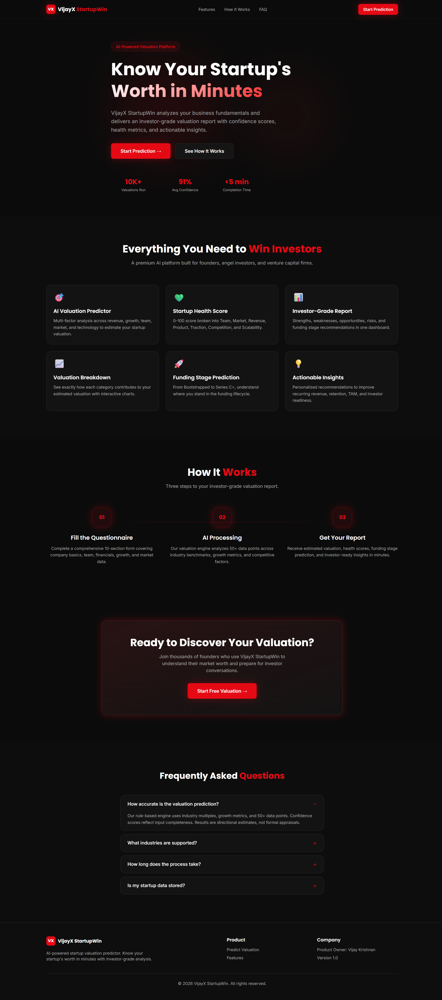
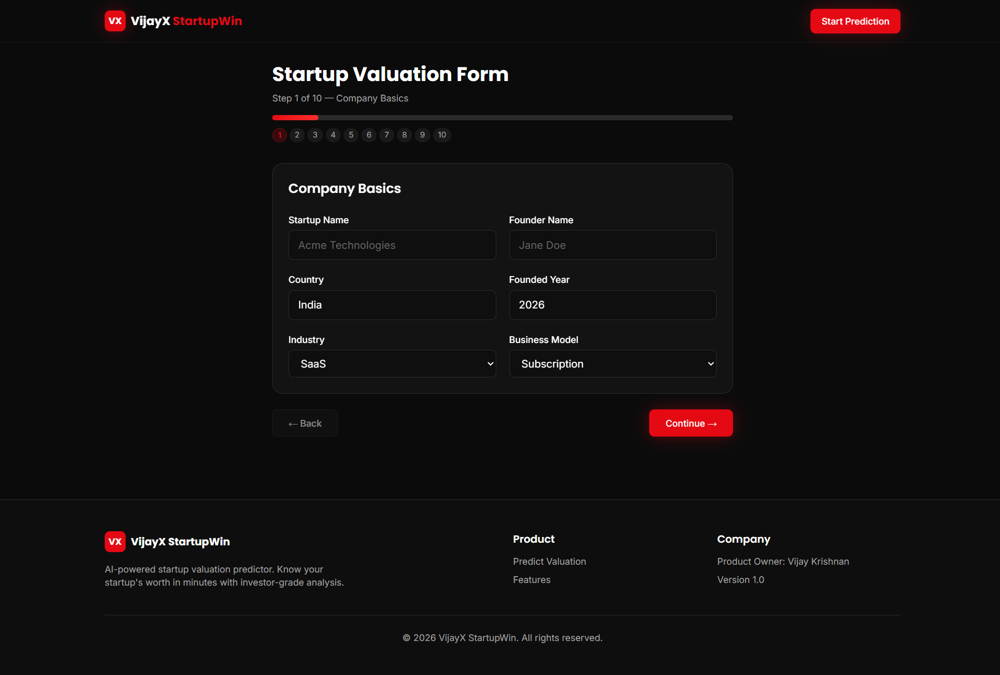
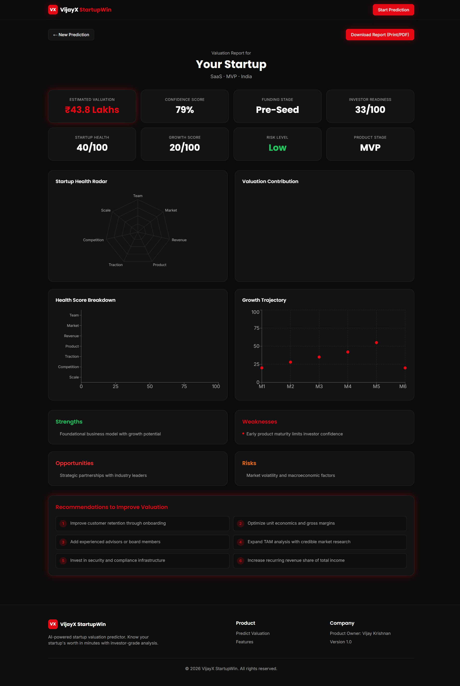

# 🚀 VijayX StartupWin

A modern AI-powered startup valuation web application that helps founders estimate their startup's worth in minutes. Enter your startup details and generate an investor-style valuation report with financial insights, startup health scores, risks, opportunities, and personalized recommendations.

## 🚀 Live Demo

🔗 [**https://vijay-starup-x.vercel.app/**](https://vijay-starup-x.vercel.app/)

---

## 📸 Screenshots

### 🏠 Landing Page



### 📝 Startup Valuation Form



### 📊 Valuation Results Dashboard



---

## ✨ Features

- 💰 Startup valuation prediction
- 📊 Startup health score
- 📈 Growth score analysis
- 🎯 Investor readiness score
- 💵 Financial analysis
- 👥 Team evaluation
- 🌎 Market analysis
- 🚀 Product-stage evaluation
- 👤 Customer traction analysis
- 🥊 Competition analysis
- ☁️ Technology and scalability assessment
- 💼 Funding-stage prediction
- ⚠️ Risk-level assessment
- 🤖 AI-powered startup insights
- 💡 AI-generated recommendations
- 📊 Interactive valuation charts
- 📈 Growth trajectory visualization
- 🖨️ Downloadable valuation report
- 📱 Responsive dark-themed interface

---

## 🤖 AI-Powered Insights

VijayX StartupWin uses an LLM through the OpenRouter API to generate personalized startup insights based on the information entered by the user.

The AI generates:

- 💪 Strengths
- ⚠️ Weaknesses
- 🚀 Opportunities
- 🔴 Risks
- 💡 Recommendations

The application combines its valuation engine with AI-powered analysis to provide startup-specific insights.

---

## 🛠️ Tech Stack

- React
- TypeScript
- Vite
- Tailwind CSS
- React Router
- Framer Motion
- Recharts
- Node.js
- Express.js
- OpenRouter API
- LLM

---

## 📦 Installation

```bash
git clone https://github.com/VIJAYAKRISHNANJ/VijayStarupX.git
cd VijayStarupX
npm install
npm run dev
````

---

## 🔑 Environment Variables

Create a `.env` file in the project root:

```env
OPENROUTER_API_KEY=your_api_key_here
```

Refer to `.env.example` for the required environment variables.

> ⚠️ Never commit your actual `.env` file or API keys to GitHub.

---

## 📁 Project Structure

```text
VijayStarupX/
├── public/
├── scripts/
│   └── run-dev.js
├── server/
│   └── index.js
├── src/
│   ├── assets/
│   ├── components/
│   │   ├── form/
│   │   ├── landing/
│   │   ├── layout/
│   │   ├── results/
│   │   └── ui/
│   ├── lib/
│   ├── pages/
│   └── types/
├── ScreenShots/
│   ├── LandingPage.png
│   ├── PredictPage.png
│   └── ResultsPage.png
├── .env.example
├── .gitignore
├── index.html
├── package.json
├── README.md
└── vite.config.ts
```

---

## ⚙️ Development

Run the frontend and backend together:

```bash
npm run dev:all
```

Frontend only:

```bash
npm run dev
```

Backend only:

```bash
npm run dev:server
```

---

## 📊 How It Works

1. 📝 Enter startup information
2. ⚙️ Analyze the startup using the valuation engine
3. 🤖 Generate personalized AI insights
4. 📊 View the valuation and startup health report
5. 📄 Download the valuation report

---

## 🎯 Project Purpose

VijayX StartupWin is designed to help startup founders understand their business position, estimate their startup valuation, identify potential risks and opportunities, and improve their investor readiness.

---

## 👨‍💻 Author

**Vijaya Krishnan J**

* GitHub: [https://github.com/VIJAYAKRISHNANJ](https://github.com/VIJAYAKRISHNANJ)

---

⭐ If you found this project useful, consider giving it a star!
